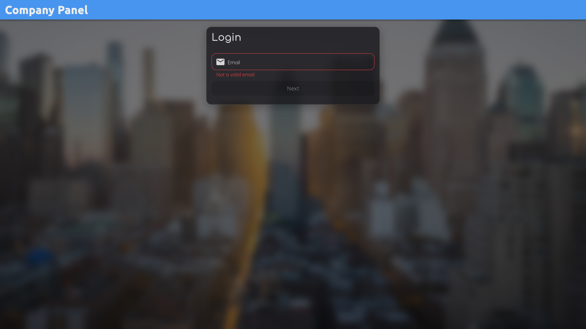
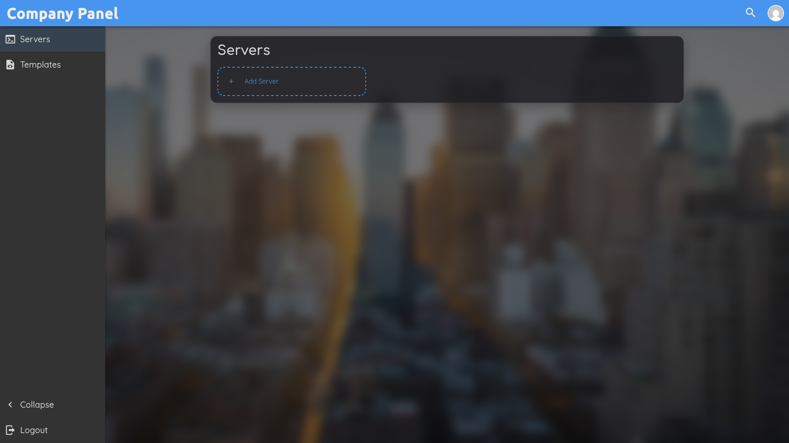
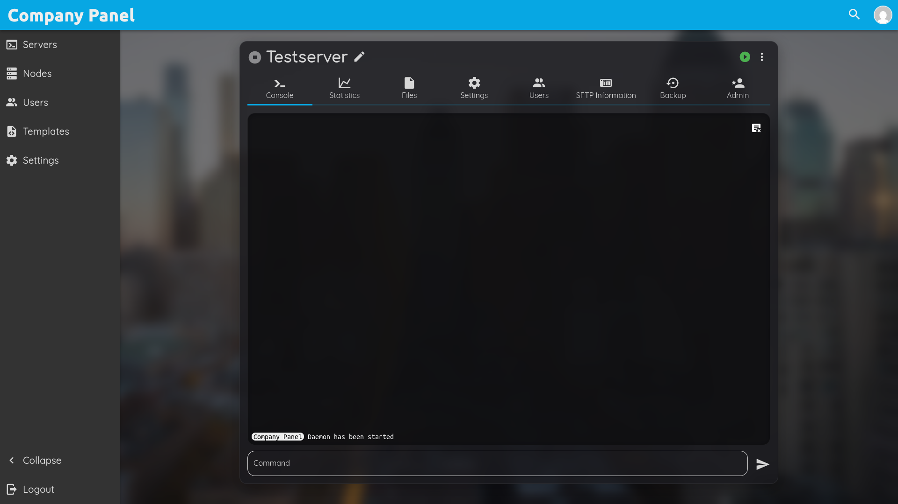

# PufferPanel v3 Theme Collection

A collection of custom themes for **PufferPanel v3** free to use.

This repository provides a variety of community-made themes to improve the look and feel of the PufferPanel V3 web interface.

---

# Installation

1. Download a theme .tar or clone this repository

```
git clone https://github.com/DerKrisp/PufferThemes.git
```

2. Copy the desired theme into your PufferPanel theme directory

```
/var/www/pufferpanel/theme/
```

3. Reload the pufferpanel page in your browser and select the new theme.

---

# Available Themes

## KrispyGlass-dark

A modern glass-style dark theme with blur effects and transparent elements.

**Features**

* custom background
* glassmorphism UI
* blurred background panels
* elegant minimal design

**Screenshots**





---

# Contributing

Contributions are welcome!

If you created your own **PufferPanel v3 theme**, feel free to share it with the community.

### How to submit a theme

1. Fork this repository
2. Add your theme as .tar
3. Add some screenshots of your theme in /screenshots/<theme>/
4. Add your theme to the **README theme list**
5. Open a **Pull Request**
